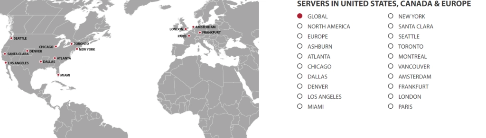

# GTHost Review: Global Server Hosting That Actually Reaches Your Customers

Got clients scattered across the globe? Tired of slow load times because your server is halfway around the world from your users? If you're looking to expand internationally without sacrificing speed, you need hosting that can keep up with your ambitions.

GTHost offers dedicated server hosting with over 17 data center locations worldwide, letting you pick exactly where your server lives and how much power you need. No cookie-cutter plans—you build what works for you.

---

## What GTHost Actually Is

Founded in 2012, GTHost (officially GLOBALTELEHOST Corp.) set out to provide affordable, high-performance hosting services to businesses operating across multiple continents. The company has grown its infrastructure to include 17+ data center locations worldwide, focusing primarily on dedicated server solutions.

Unlike traditional hosting providers that lock you into preset tiers, GTHost lets you configure your server based on your actual storage needs and preferred geographic location. You're not paying for features you don't need or settling for a location that's "close enough."

## Where Your Server Can Live

GTHost's data centers span multiple continents, giving you genuine options for server placement:

The locations include major hubs across North America, Europe, Asia, and beyond. This geographic diversity means you can position your server close to your actual user base—whether that's Tokyo, London, or New York—rather than settling for whatever location your hosting provider happens to offer.

## Security That Doesn't Feel Like an Afterthought

Your data represents months or years of work. Losing it or having it compromised isn't an option.

GTHost includes DDoS protection as standard, actively monitoring and mitigating attacks before they impact your server's performance. The platform also prevents outbound attacks, meaning you won't inadvertently become part of someone else's security problem.

All data transmission is encrypted using SSL software, keeping your information secure both in transit and at rest. It's the kind of baseline security you should expect but don't always get with budget hosting providers.

## Support When You Need It

Migrating to new hosting can be stressful. There's always that period where you're not quite sure how everything works yet, and you just need someone to answer a straightforward question.

GTHost maintains 24/7 customer support through multiple channels: live chat, phone, and email. They've organized their support email addresses by category (technical, billing, etc.), so your inquiry goes directly to someone who can actually help rather than bouncing around departments.

👉 [Want hosting that scales with your global ambitions? Check out GTHost's flexible dedicated server options](https://cp.gthost.com/en/join/72c7e6b2fc118929f9ede2978f008806)

## What Makes GTHost Different

### Unlimited Bandwidth

Most hosts cap your bandwidth and charge overage fees when you exceed it. This creates an artificial ceiling on your growth—you either accept slower performance or pay unpredictable extra costs.

GTHost removes this limitation entirely. No bandwidth caps, no surprise charges. Your server can handle traffic spikes without you nervously watching the meter.

### Fast Setup

Many dedicated server providers make you wait hours or even days for server provisioning. GTHost typically has your server configured and ready within 5-15 minutes of purchase. You're not wasting half a day waiting to get started.

### Full Root Access

You have complete control over your server. No restrictions on what you can install, configure, or modify. If you need to make system-level changes, you can—without submitting a support ticket and waiting for someone else to do it for you.

This level of access is standard for dedicated servers, but it's worth confirming. Some "managed" dedicated server hosts restrict root access in ways that can be frustrating when you need to customize your environment.

## Pricing Structure

GTHost focuses primarily on dedicated servers with customizable configurations. You select your storage requirements and preferred location, and pricing adjusts accordingly.

Base pricing starts around $59/month, but your actual cost depends on the specifications you choose. This build-your-own approach means you're not overpaying for unnecessary features, but it also requires you to understand what resources you actually need.

The company offers what they describe as "low-cost trial periods" ranging from 1-10 days rather than a traditional free trial. The terms here are a bit unclear, so review their terms of service before committing if you want to test the platform first.

## Who Should Consider GTHost

GTHost makes the most sense for:

- **Businesses with international customers** who need servers in specific geographic regions
- **Companies outgrowing shared hosting** that need dedicated resources
- **Organizations with specific compliance requirements** around data location
- **Tech teams that want full control** over their server environment

It's probably not the right choice if you're just starting out and aren't sure what resources you need yet, or if you prefer fully managed hosting where someone else handles the technical details.

## The Bottom Line

GTHost delivers on its core promise: flexible dedicated server hosting with genuine geographic options. The 17+ data center locations give you real choice in server placement, and the unlimited bandwidth removes a common constraint on growth.

The security features (DDoS protection and SSL) are solid but not exceptional—they're what you should expect from any reputable dedicated server host. The fast setup and full root access are genuinely useful for teams that need to get running quickly and customize their environment.

The main weakness is clarity around trial terms and pricing. The "low-cost trial period" concept is confusing, and the custom pricing model means you need to know what you're looking for before you can estimate costs.

If you're expanding internationally and need servers positioned near your users, 👉 [GTHost's global infrastructure and flexible configurations make it worth exploring](https://cp.gthost.com/en/join/72c7e6b2fc118929f9ede2978f008806).

## Common Questions About GTHost

**Does GTHost offer a free trial?**

Not exactly. GTHost offers "low-cost trial periods" of 1-10 days rather than completely free trials. The specifics are unclear from their marketing materials, so check their terms of service if you want to test the platform before committing to a full month.

**How much does GTHost actually cost?**

Pricing starts at $59/month for basic configurations, but your actual cost depends on the storage, processing power, and data center location you select. The build-your-own approach means costs vary significantly based on your specific needs.

**What kind of support does GTHost provide?**

GTHost offers 24/7 support through live chat, phone, and email. They maintain separate email addresses for different support categories (technical, billing, etc.), which helps route inquiries to the right team faster.

**Does GTHost offer dedicated servers?**

Yes, dedicated servers are GTHost's primary offering. You can configure a dedicated server in your preferred location with the storage and resources you need, with pricing starting around $59/month.

---

GTHost won't win any awards for the most beginner-friendly interface or the clearest pricing transparency, but for businesses needing dedicated servers in specific global locations with unlimited bandwidth, it delivers the core functionality that matters. The 17+ data center options give you genuine flexibility in server placement, and the customizable configurations mean you're not locked into someone else's idea of what your infrastructure should look like.
